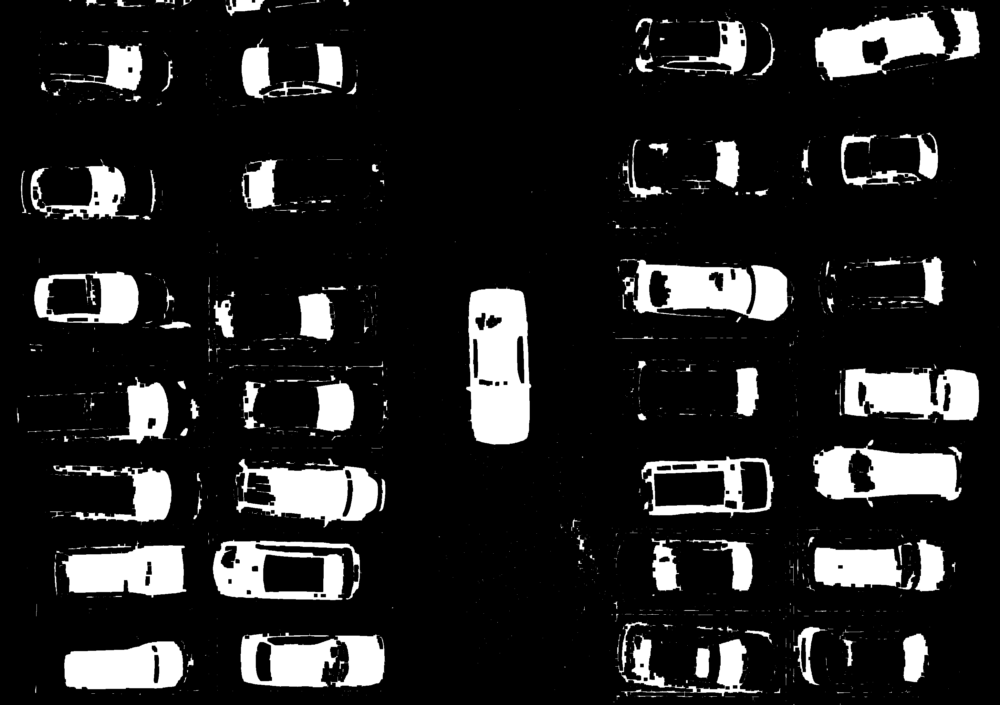

# MP2: Object Counting (Vehicle Detection in Parking Area)

## Identitas yang melakukan pekerjaan
- **Nama**: Rahmat Maulana Ansori
- **NRP**: 5024241011
- **Tugas**: Menghitung jumlah mobil pada foto dari atas parkiran menggunakan teknik pengolahan citra

---

## Rumusan Masalah

Citra di folder input memiliki tantangan untuk dihitung berupa:
- Posisi mobil yang saling berdekatan.
- Variasi warna dan pencahayaan (mobil putih rentan menyatu dengan aspal/marka).
- Berbagai ukuran mobil dan bayangan yang memecah deteksi.

**Input**: Foto aerial area parkir yang berisi sejumlah mobil dengan warna bervariasi.

**Output**: 
- Jumlah mobil yang terdeteksi (berdasarkan total kotak hijau final).
- Citra dengan bounding box/marking untuk setiap mobil yang terdeteksi.

---

## Pipeline Deteksi dan Cara Kerja

```text
Input Gambar (Original BGR)
         ↓
[Step 1] Color Masking & Morphology
  - Convert gambar ke HSV
  - Masking menggunakan cv2.inRange dengan nilai [0,50,50] - [130,255,255]
  - Morphological Closing (Kernel 10x10) untuk memadatkan bercak piksel
         ↓
[Step 2] Find Contours & Size Filtering
  - Menggunakan cv2.findContours
  - Filter ukuran (mengabaikan noise/titik kecil di bawah batas panjang/lebar tertentu)
         ↓
[Step 3] Spatial Bounding Box Merging (Custom Logic)
  - Klasifikasi Bounding Box menjadi Besar (Mobil) dan Kecil (Kaca Mobil).
  - Jika ada dua kotak "Kecil" saling berdekatan secara horizontal (gap X <= 290) 
    dan berada di baris yang sama (selisih Y <= 100), gabungkan menjadi satu kotak.
  - Gabung mutlak jika jarak X dan Y sangat rapat (overlap/terpecah karena noise).
         ↓
Output (Final Bounding Box Render)
```

## Cara Menjalankan Program

### Prerequisite
```bash
pip install opencv-python numpy matplotlib
```

### Run Individual Methods (untuk analysis)
```bash
# Color-based approach
python counting.py
# Edge detection approach
python edge.py
```

---

## Analisis dan Insight

### Hasil Deteksi
**masking**:


**boundingbox**:


### Analisis dari Pembaruan Hasil Deteksi 

1. Analisis Masking (Mengatasi Mobil Putih)
Pendekatan warna dasar tidak bisa mendeteksi bodi mobil putih karena warnanya tidak bisa dimasking mau berapapun nilai hue nya dimasukkan. Tapi masking HSV berhasil menangkap kaca depan dan belakang mobil putih yang berwarna lebih gelap/kebiruan. Bagian kaca ini saya manfaatkan sebagai perwakilan mobil untuk mendeteksi keberadaan mobil.

2. Analisis Bounding Box 
Berkaca dari masalah awal di mana satu mobil putih terdeteksi sebagai dua objek terpisah yaitu kaca depan dan kaca belakang, saya mengimplementasikan algoritma spatial merging. Bounding box difilter berdasarkan lebarnya. Kotak berukuran kecil tidak langsung dianggap sebagai noise, melainkan dicari pasangan kotak kecil lain yang berada di baris parkir yang sama dengan jarak horizontal yang divariasikan sampai benar.

3. Analisis Hasil Akhir
Hasil deteksi kini sangat baik dan hasil jumlah bounding box sama persis dengan jumlah mobil. Meski ada satu mobil yang kaca belakangnya tergabung dengan kaca depan mobil belakangnya. Algoritma sudah mampu membedakan bounding box kecil dan besar. Dua kaca mobil putih yang sebelumnya terpisah kini berhasil diikat menjadi satu bounding box hijau besar berkat modifikasi logika jarak pada sumbu X dan Y.

## Insight 
1. Morphology (Kernel 10):
Hasil masking yang diberi morphology sangat bagus dan jadi gamechanger, jumlah bounding box noise berkurang drastis.
.

### Apa yang Berhasil

✓ Bisa membedakan mobil dengan aspal.

✓ Bisa memfilter bounding box kecil dari noise aspal/bayangan.

✓ Bisa mendeteksi mobil terang/putih dengan memanfaatkan kaca depan dan belakang.

✓ Berhasil menyatukan dua kaca mobil yang terpisah menjadi satu bounding box mobil utuh menggunakan logika spasial jarak horizontal dan vertikal.

✓ Bisa membatalkan penggabungan jika jaraknya melebihi ukuran wajar satu mobil.

---

**Status**: COMPLEETEDDD

**Last Updated**: 2026 

