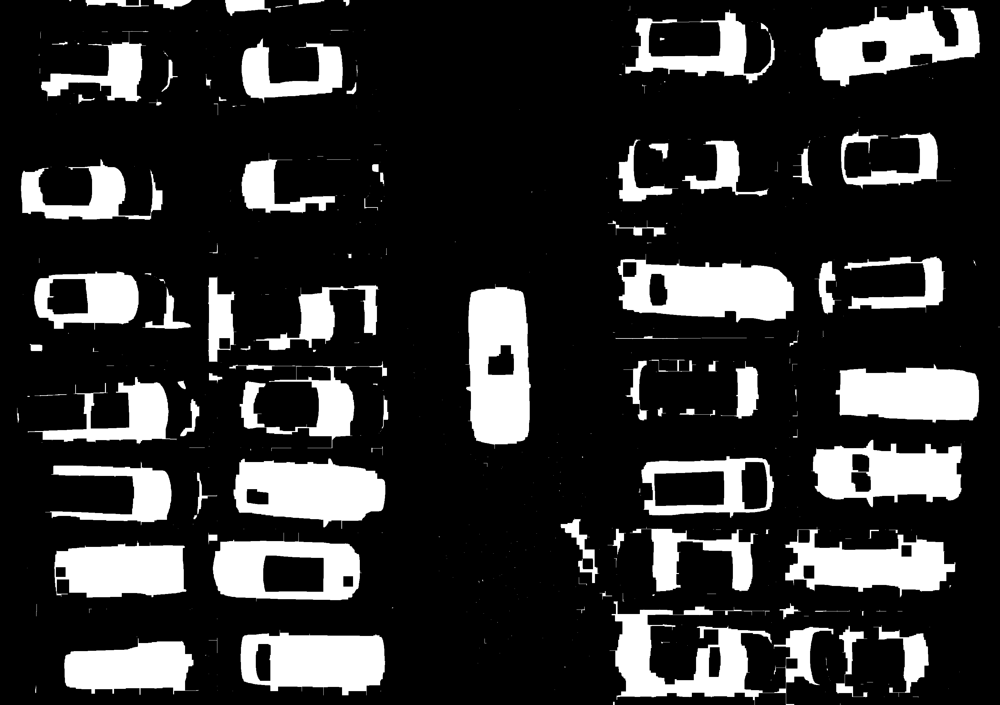

# MP2: Object Counting (Vehicle Detection in Parking Area)

## Identitas yang melakukan pekerjaan
- **Nama**: Rahmat Maulana Ansori
- **NRP**: 5024241011
- **Tugas**: Menghitung jumlah mobil pada foto dari atas parkiran menggunakan teknik pengolahan citra

---

## Rumusan Masalah

Citra di folder input memiliki tantangan untuk menghitung berupa:
- Posisi mobil yang berdekatan 
- Variasi warna dan pencahayaan
- Berbagai ukuran mobil

**Input**: Foto aerial area parkir yang berisi sejumlah mobil dengan warna bervariasi

**Output**: 
- Jumlah mobil yang terdeteksi
- Citra dengan bounding box/marking untuk setiap mobil
---

## Pipeline Deteksi dan Perbandingan Metode

```
Input Gambar (tanpa bounding box)
         ↓
[Step 1] Masking
  - Convert gambar ke HSV
  - Masking menggunakan cv2.inrange dengan range hsv [0,50,50] - [130,255,255] 
         ↓
[Step 2] Find Contours
  - menggunakan findcontours
  - filter ukuran contours 
         ↓
[Step 3] Combine Boundingbox overlap
  - get xywh bounding box
  - jika overlap maka jadi satu boundingbox 
         ↓
Output (Restored)
```
---

## File-file Proyek

```
MP2_Object_Counting/
├── README.md                              # File ini
├── counting.py                            # Pendekatan berbasis color
├── edge.py                                # Pendekatan berbasis edge
├── parking_ori.jpg                        # Input image
└── counting_result.png                    # Output image
```
---

## Cara Menjalankan Program

### Prerequisite
```bash
pip install opencv-python numpy matplotlib
```

### Run Individual Methods (untuk analysis)
```bash
# Color-based approach
python counting.py
# Edge detection approach
python edge.py
```

---

## Analisis dan Insight

### Hasil Deteksi 

**masking**:


**boundingbox**:


### Analisis dari Hasil Deteksi yang Tidak Sampoerna Seperti yang Dilihat 

1. Analisis Masking
Untuk masking hanya bisa warna selain putih, jadi mobil merah, biru muda dan navy tidak masalah. Mobil putih sebenarnya tidak masalah juga karena windsheild nya ikut kedetect karena navy tapi harus kasi logic lagi yaelah malaz.  

2. Analisis Boundingbox
Berkaca dari masalah sebelumnya dimana hasil contour terlalu banyak karena kumpulan titik kecil yang jauh dideteksi sebagai objek sendiri, inovasi saya kali ini adalah filtering dimana besar boundingbox tidak boleh lebih dari variabel hardcode saya. 

3. Analisis Hasil
Hasil deteksi sangat bagus, satu mobil sekarang tidak memiliki boundingbox kecil kecil dan sekarang dianggap seperti satu boundingbox yang besar. Namun seperti yang saya katakan tadi, mobil putih hanya terdeteksi kacanya saja sehingga kedepannya saya harus membuat algoritma untuk membedakan boundingbox kaca dan mobil. 

### Apa yang Berhasil

✓ Bisa membedakan mobil dengan aspal
✓ Bisa mendeteksi salah satu objek dari mobil
✓ Bisa filter boundingbox kecil dari noise
✓ Bisa combine boundingbox overlap
  Bisa menganggap kaca mobil adalah perwakilan mobil
  Bisa menganggap dua kaca mobil adalah satu mobil

---

**Status**: onprogress
**Last Updated**: 2026

